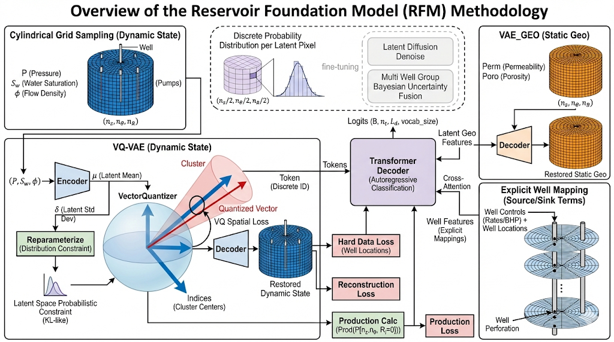

# 🛢️ Reservoir Foundation Surrogate (RFS)

**基于 VQ-VAE 时序动静态特征融合的油藏模拟大模型**

## 🗺️ 架构总览 (Methodology Overview)

本项目核心方法论如下图所示：



本项目致力于构建一个端到端（End-to-End）的 3D 物理场演化基础模型。我们将自然语言处理领域最前沿的大模型技术（LLM, Next-Token Prediction, FlashAttention）与油藏工程的底层物理规律（极坐标渗流、边界阻断、径向不确定性、井点硬约束）进行了深度的底层缝合。

项目采用 **两阶段训练范式 (Two-Stage Pipeline)**，第一阶段利用受物理约束的 VQ-VAE 将流体动态场压缩为离散的物理密码本 (Physical Codebook)；第二阶段利用 Decoder-only Transformer 进行自回归的时空物理推演。

---

## 🌟 核心创新与特性 (Key Innovations)

1. **几何拓扑与物理边界的绝对对齐 (Physics-Aligned Masking)**
* **环形卷积 (`Conv3dCircularTheta`)**：摒弃了传统的零填充，在方位角 () 维度实现真正的物理首尾相接，彻底消除了极坐标系下的“物理断崖”。
* **无效区域掩码阻断 (Masked Shielding)**：从底层 `Encoder` 的激活阻断、到 `VectorQuantizer` 剔除“石头”区域的聚类更新、再到 `Transformer` 内部的 Cross/Self Attention  掩码与 `0` Padding 标签替换，建立了一套密不透风的“物理边界防疫系统”，确保网络 100% 专注有效油藏区域。


2. **自适应的不确定性空间约束 (Uncertainty-Guided Latent Manifold)**
* **径向加权约束 **：引入空间距离衰减加权，允许模型在远井区域输出高方差的宽泛先验，而强制近井区域严格对齐物理观测数据，完美平替并超越了传统的 KL 散度。
* **硬数据损失 (`Hard Data Loss`)**：在稀疏的井位 () 强行施加超高权重的 MSE 惩罚，锁死井口/井底历史真实物理数据的边界条件。


3. **LLM 级的高效多模态融合引擎**
* **解耦的 Transformer 骨干 (`DecoderFusionTransformer`)**：支持时空切片的块状因果掩码 (Block Causal Mask) 和 3D 极坐标相对位置编码。
* **多特征融合 (`MultiFeatureFusion`)**：基于原生 `F.scaled_dot_product_attention` 实现极速 Cross-Attention，完美支持地质静态场 (`VAE-Geo`) 与井控脉冲等异构特征的自回归条件注入。


---

## 📂 项目结构 (Project Structure)

```Catalog
jbgs-pt/
├── data/                        # 数据处理与 DataLoader
│   ├── polar_utils.py           # 核心：KDTree 极坐标采样、对数径向网格化与坐标逆映射
│   ├── dataset_vqvae.py         # Stage 1 数据集：提供打散的时间轴静态三维场
│   └── dataset_transformer.py   # Stage 2 数据集：提供 nt_width 截断与重叠滑动时间窗口
│
├── models/                      # 模型组件与核心网络
│   ├── layers.py                # 公共底层算子 (环形卷积、3D Attention、FNN、DecoderLayer)
│   ├── embeddings.py            # 3D 极坐标绝对位置编码与 Block Causal Mask 矩阵生成
│   ├── attention.py             # 支持 KV-Cache 和 FlashAttention 的自注意力/交叉注意力模块
│   ├── vae_geo.py               # 静态地质 (孔/渗) 的连续空间编码器 (Geo-VAE)
│   ├── vqvae.py                 # 动态物理场 (P, Sw, Ψ) 的概率向量量化自编码器 (QA-VAE)
│   └── transformer.py           # 时空推演主体：DecoderFusionTransformer
│
├── trainer/                     # PyTorch Lightning 训练控制脚本
│   ├── pt_train_stage1_vaes.py  # 阶段 1：独立并行训练 VQ-VAE 与 Geo-VAE
│   └── pt_train_stage2_llm.py   # 阶段 2：冻结 Stage 1 编码器，在潜空间训练自回归 Transformer
│
└── .gitignore                   #

```

---

## ⚙️ 核心工作流 (Pipeline)

### Stage 1: Representation Learning (表示学习)

在此阶段，我们将高维的、物理量级相差悬殊的连续物理场转换为紧凑的表示：

1. **地质编码 (`VAE-Geo`)**：处理不随时间变化的静态孔渗场，提取空间特征（可配置为 FCN 结构以保留绝对的空间对齐）。
2. **流体量化 (`QA-VAE`)**：处理动态的 ，通过重参数化提取  并通过 Vector Quantizer 将其映射为词表大小为  的离散整数 Token 序列。

### Stage 2: Autoregressive Rollout (自回归时空推演)

1. **数据准备**：将 Stage 1 提取的 Token IDs 送入 `DecoderFusionTransformer`。
2. **掩码计算**：结合 `generate_block_causal_mask` 限制时空视野，利用 `spatial_mask` 阻断岩石边界，将无效区域隐式映射为无梯度的特殊 Padding Index (`0`)。
3. **推演**：利用 Transformer 极其强大的上下文学习能力，结合跨模态的地质与井控特征，预测下一个物理时间步的 Token 分布。

---

## 🚀 快速开始 (Quick Start)

*(To Be Continued: 待完善具体的数据集准备指令、依赖环境安装 `requirements.txt` 及对应的 `train.py` 启动命令)*

---

*Developed for Next-Generation Reservoir Surrogate.*